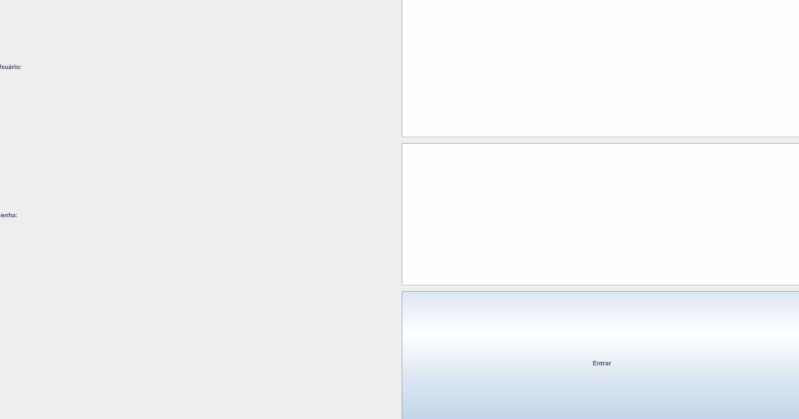

#  Sistema Financeiro em Java


Projeto desenvolvido em Java com foco em **Programação Orientada a Objetos (POO)** e construção de **interface gráfica (GUI)** utilizando Swing.

O sistema simula um ambiente de controle financeiro com múltiplos usuários, autenticação e registro de movimentações.

---


##  Demonstração



>  Caso o GIF não apareça, verifique se o arquivo `demo.gif` está na raiz do projeto.

---
##  Instruções de uso

Ao iniciar o programa, a tela de login será exibida.

### . Fazer login
Use um dos usuários padrão cadastrados no sistema:

```text
Usuário: admin
Senha: 1234
##  Funcionalidades

- Login de usuários
- Cadastro de novos usuários
- Registro de receitas
- Registro de despesas
- Visualização de saldo
- Exibição de extrato
- Logout

---

##  Interface

O sistema utiliza **Java Swing** para interface gráfica, com:

- Tela de login
- Tela principal com botões de ação
- Área de exibição de extrato
- Caixas de diálogo para entrada de dados

---

##  Arquitetura do Projeto

O projeto segue uma separação clara de responsabilidades:

- **Usuario** → autenticação e dados do usuário  
- **Conta** → lógica financeira (saldo e operações)  
- **Movimentacao** → representação das transações  
- **TelaLogin / TelaPrincipal** → interface gráfica  
- **Main** → inicialização do sistema  

---

##  Estrutura do Projeto

```text
SistemaFinanceiro/
├── Main.java
├── Usuario.java
├── Conta.java
├── Movimentacao.java
├── TelaLogin.java
├── TelaPrincipal.java
└── demo.gif
